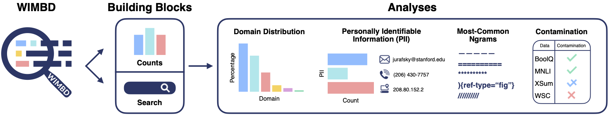

# What's in my big data?

[Paper](http://arxiv.org/abs/2310.20707) || [Demo](https://wimbd.apps.allenai.org) || [Artifacts](https://console.cloud.google.com/storage/browser/wimbd)

## News
- August 2024: added the [Dolma v1.7 dataset](https://huggingface.co/datasets/allenai/dolma) to our index
- August 2024: added the [Tulu2 dataset](https://huggingface.co/datasets/allenai/tulu-v2-sft-mixture) to our index
- August 2024: added functionality to the es search that allows flexible queries in between text terms
- August 2024: pypi package release of the elasticsearch wrapper. Install by running `pip install wimbd`
- April 2024: WIMBD was accepted to ICLR!
- October 2023: first release


This repository contains the code for running What's In My Big Data (WIMBD), which accompanies our [recent paper](http://arxiv.org/abs/2310.20707) (with the same name).




> What is WIMBD?

WIMBD is composed of two components
1. A set of tools for analyzing and revealing the content of large-scale datasets
2. A set of analyses we apply to those datasets, using the aforementioned tools

*WIMBD tools* consist of two parts:

1. Count
2. Search

The count follows a map-reduce functionality, which divides the task into smaller chunks, applies the operation (e.g., extract the domain from a URL) and then aggregates the counts.
We have two implementations for this. One through python functions (e.g., for [domain counts](wimbd/url_counts/)) which is easily extendable and scalable,
and one through a Rust CLI for faster processing. The [Rust implementation](wimbd/src/) covers the summary statistics (presented in Table 2 in the paper) such as the corpus size, number of tokens, etc. In addition, it computes the most & least common $n$-grams approximation using counting Bloom filters.

In practice, we implement search using [elasticsearch](https://www.elastic.co/). We index 5 of the corpora we consider, and provide both a UI and a programmatic access to those.
We built some wrappers around the ES API, which allows `count` and `extract` functionalities. We provide a more detailed documentation [here](./wimbd/es/README.md).


## Getting started

There are two distinct parts of this toolkit: a Python library of functions and a Rust-based CLI.

### Using the Python library

#### Create python environment
```
conda create -n wimbd python=3.9
conda activate wimbd

pip install -r requirements.txt

export PYTHONPATH="${PYTHONPATH}:/PATH/TO/wimbd/"
```

As an example, run the following command that counts the domain counts, per token (Section 4.2.2 in the paper):
```sh
bash wimbd/url_per_tok_counts/run.sh /PATH-TO/c4/en/c4-train.* > data/benchmark/benchmark_url_tok_c4.jsonl
```

#### Run scheme counts

```
./wimbd/scheme_counts/run.sh /PATH-TO/laion2B-en/*.gz > data/scheme_laion2B-en.jsonl
```

This will run the map reduce scripts, and dump the results into a file


### Using the Rust CLI

This part of the repository is written in Rust, so first you'll have to [install the Rust toolchain](https://www.rust-lang.org/tools/install). There's a simple one-liner for that:

```bash
curl --proto '=https' --tlsv1.2 -sSf https://sh.rustup.rs | sh
```

Then you can either install the latest release from [crates.io](https://crates.io/crates/wimbd) directly or install from source.
To install from `crates.io`, run:

```bash
cargo install wimbd
```

Or to install from source, run:

```bash
make release DIR=./bin
```

(make sure to change `DIR` to a directory of your choice that's on your `PATH`)

And now you should have be able to run the `wimbd` CLI:

```bash
wimbd --help
```

For example, find the top 20 3-grams in some c4 files with:

```bash
wimbd topk \
    /PATH-TO/c4/en/c4-train.01009-of-01024.json.gz \
    /PATH-TO/c4/en/c4-train.01010-of-01024.json.gz \
    -n 3 \
    -k 20 \
    --size 16GiB
```

## Search

We provide a wrapper to the elasticsearch api library, and provide customized functions that better serve the kinds of functionality we are interested in this line of work.

Due to the nature of ElasticSearch, we cannot release the API keys on the web.
However, there is simple form that you can fill up and we can provide access to certain corpora.
If you are interested in using our ElasticSearch indices, please fill up this [form](https://forms.gle/Mk9uwJibR9H4hh9Y9), and we'll get back to you with the keys as soon as we can.

The code of our wrapper can be found [here](wimbd/es/).

It can also be used through our wimbd package!

```sh
pip install wimbd
```


Missing a functionality? open an issue, or a PR, and we could add it to the library.

## Issues

If there's an issue with the code, or you have questions, feel free to [open an issue](https://github.com/allenai/wimbd/issues/new/choose)
or send a [PR](https://github.com/allenai/wimbd/compare)

